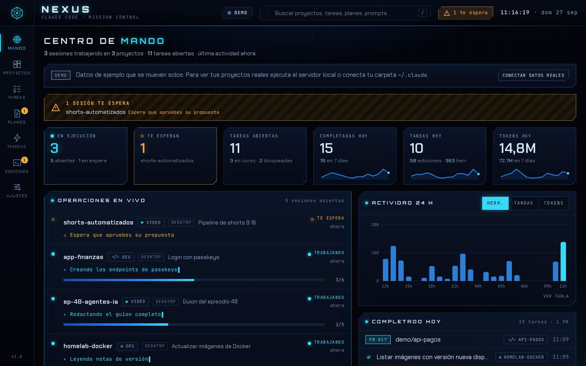

# Experimentos

## [NEXUS · centro de mando para Claude Code](nexus/)

Panel cyberpunk para seguir las sesiones, tareas, tandas y planes que Claude Code (Desktop, CLI o VS Code) va haciendo en todos tus proyectos, incluidos los vídeos del canal. Incluye la skill `/nexus` para que Claude te cuente qué está pendiente o abra el panel.

```bash
node nexus/bin/nexus.mjs install   # skill /nexus
node nexus/bin/nexus.mjs open      # panel en http://127.0.0.1:2077
```


