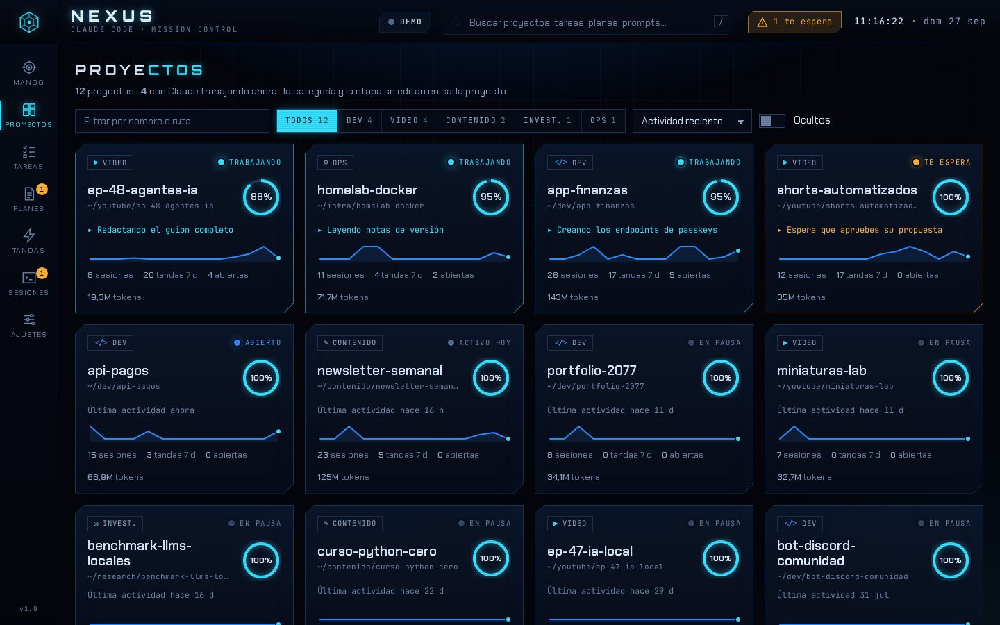
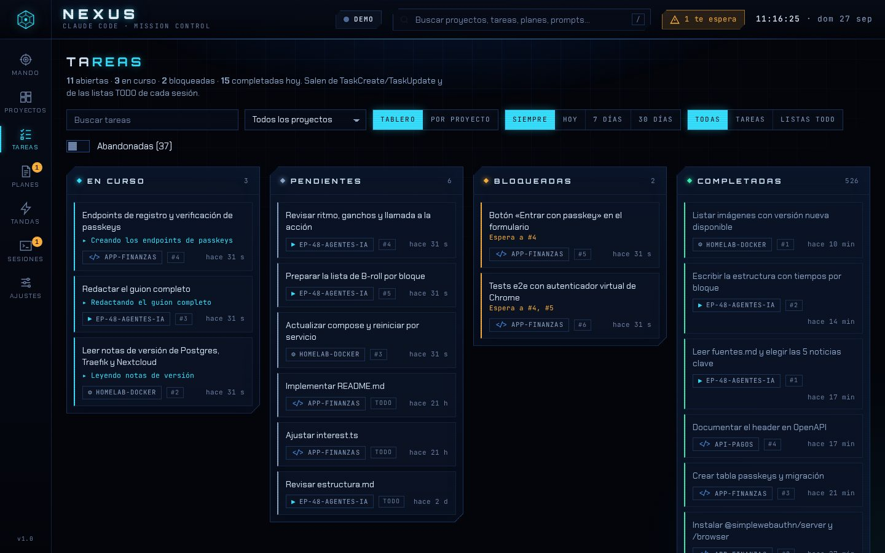
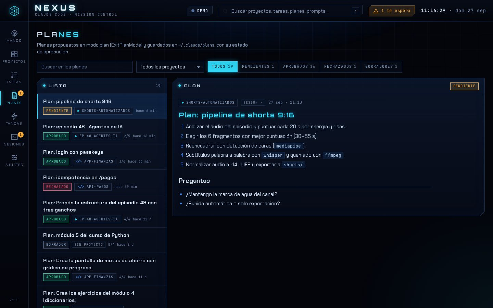
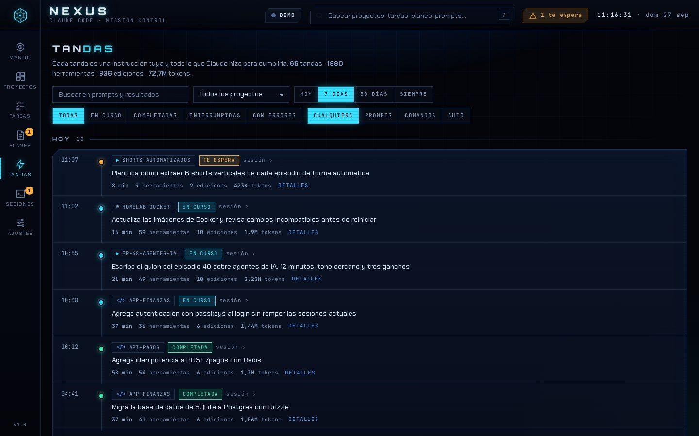

# NEXUS · centro de mando para Claude Code

Panel cyberpunk (negro y azul) para seguir **todo lo que Claude Code hace en tus proyectos**: sesiones en vivo, tareas, tandas de trabajo y planes, tanto de desarrollo como de los vídeos de tu canal o cualquier otra cosa en la que uses Claude Code (Desktop, CLI o VS Code).


## Por qué así: una app local + una skill

Claude Code ya escribe en `~/.claude` todo lo que hace: cada conversación, cada tarea, cada plan y hasta el estado de las sesiones abiertas. NEXUS **lee esos archivos** en lugar de pedirle a Claude que "reporte" su trabajo. Eso significa:

- **Cero tokens y cero fricción.** No cambia cómo trabajas; cualquier sesión, en cualquier carpeta, aparece sola.
- **Tiempo real.** Ves qué sesión está trabajando, cuál **te espera** (permiso, pregunta o plan por aprobar) y qué tarea tiene entre manos.
- **Privado.** Todo ocurre en tu ordenador; el servidor solo escucha en `127.0.0.1`.
- **Historial que no se pierde.** Claude Code borra las transcripciones a los 30 días; NEXUS guarda el resumen en `~/.claude-nexus` y lo sigue mostrando.
- **Escala.** Probado con 2.000 sesiones y 900 MB de transcripciones: el primer escaneo tarda unos 9 s y después arranca en menos de un segundo gracias a su caché.

Y como skill (`/nexus`), Claude puede abrir el panel, contarte qué tienes pendiente en todos tus proyectos o clasificar el proyecto actual como vídeo, desarrollo, etc.

## Instalación (2 minutos)

Requiere **Node 18 o superior** (`node -v`).

```bash
git clone https://github.com/lean19r-cell/Experimentos.git
cd Experimentos
node nexus/bin/nexus.mjs install     # instala la skill /nexus en ~/.claude/skills/nexus
node nexus/bin/nexus.mjs open        # arranca el servidor y abre http://127.0.0.1:2077
```

Reinicia Claude Code o Claude Desktop y ya puedes escribir `/nexus` o preguntarle «¿qué tengo pendiente?».

**Actualizar:** tras traer una versión nueva vuelve a ejecutar `node nexus/bin/nexus.mjs install` (refresca la skill) y reinicia el servidor con `node nexus/bin/nexus.mjs stop` y luego `open`. La primera vez releerá tus transcripciones para calcular el consumo por día y modelo; tu historial guardado no se pierde.

### Acceso directo (doble clic)

```bash
node nexus/bin/nexus.mjs install --shortcut
```

Crea un icono **NEXUS** en tu escritorio que arranca el servidor si hace falta y abre el panel, sin pasar por la terminal ni por Claude:

- **Mac:** `NEXUS.app` en el Escritorio, sin ventana de terminal. Arrástralo al Dock si lo quieres siempre a mano.
- **Windows:** `NEXUS.lnk` en el Escritorio y en el menú Inicio (escribe «NEXUS»).
- **Linux:** lanzador en el escritorio y en el menú de aplicaciones.

Si algo falla al abrirlo, verás un aviso con el motivo (por ejemplo, que el puerto 2077 está ocupado por otro programa). Si cambias de versión de Node o mueves la carpeta, vuelve a crearlo con `node nexus/bin/nexus.mjs shortcut`; para quitarlo, `shortcut --remove`. También puedes pedírselo a Claude: «/nexus crea el acceso directo».

**Avisos instantáneos (opcional).** Sin hooks el panel se actualiza en uno o dos segundos. Con hooks, cada evento llega al momento y el servidor puede arrancar solo al abrir cualquier sesión:

```bash
node nexus/bin/nexus.mjs install --hooks --autostart
```

Se modifica `~/.claude/settings.json` (se guarda antes una copia de seguridad y se respetan tus hooks). Para quitarlos: `node nexus/bin/nexus.mjs hooks --remove`.

### Sin instalar nada

Abre `nexus/web/index.html` en Chrome o Edge, pulsa **Conectar carpeta** y elige tu carpeta `.claude` (en macOS, `⌘⇧.` muestra las carpetas ocultas). Lee los mismos datos directamente desde el navegador. No tiene historial propio ni avisos por hooks, pero no necesita Node.

Para ver cómo se ve sin tus datos: `node nexus/bin/nexus.mjs demo`.

## Qué verás

| Vista | Para qué sirve |
|---|---|
| **Mando** | Qué sesiones trabajan o te esperan ahora, tareas abiertas, lo completado hoy, actividad de 24 h, mapa de 26 semanas y registro en vivo de cada herramienta que usa Claude. |
| **Proyectos** | Una ficha por carpeta con categoría (desarrollo, vídeo, contenido, investigación, ops), etapa, avance de tareas y actividad. Los worktrees se agrupan con su repositorio. |
| **Tareas** | Tablero *En curso / Pendientes / Bloqueadas / Completadas* de todos los proyectos, o agrupado por proyecto. Las tareas abiertas de sesiones cerradas hace días se marcan como abandonadas y no inflan los contadores. |
| **Planes** | Cada plan del modo plan con su estado (pendiente, aprobado, rechazado, borrador) y su texto renderizado. |
| **Tandas** | Cada instrucción tuya y lo que Claude hizo para cumplirla: duración, herramientas, archivos editados, tokens, errores e interrupciones. |
| **Sesiones** | Tabla ordenable de todas las conversaciones, con origen (Desktop, CLI, VS Code…) y el comando para retomarlas (`claude --resume <id>`). |
| **Consumo** | Tokens y coste **estimado** por día (o semana), proyecto y modelo, con la lectura de caché. Usa los precios de lista de la API, que puedes corregir en Ajustes; un modelo sin precio muestra solo tokens. |
| **Ajustes** | Categoría, etapa y visibilidad de cada proyecto, precios de los modelos, avisos (en el panel, del sistema, con sonido) y efectos visuales. |

Atajos: `/` busca en todo, `1`–`8` cambian de vista (siguen el orden del menú lateral), `Esc` cierra.

### Avisos con sonido

NEXUS te avisa, con un toast en el panel y opcionalmente con una notificación del sistema (si la pestaña está en segundo plano) y un tono, cuando:

- una sesión **te espera** (permiso, pregunta o plan por aprobar);
- una **tanda termina**: completada, interrumpida o con errores;
- una **tarea se completa** (tareas de Claude Code y elementos de las listas TODO).

Cada tipo de aviso se activa por separado en **Ajustes → Avisos**, que también tiene botones para probar los cuatro tonos. Si terminan varias cosas a la vez se agrupan en un solo aviso y suena un único tono. El navegador solo reproduce sonido después de que hayas hecho clic o pulsado una tecla en la página.

| Proyectos | Tareas |
|---|---|
|  |  |
| **Planes** | **Tandas** |
|  |  |

### Proyectos de tu canal

Las carpetas con nombres como `youtube`, `canal`, `video`, `shorts`, `guion` o `miniatura`, o en las que Claude usa `ffmpeg`, `whisper` o `yt-dlp`, se clasifican solas como **vídeo**. Cada categoría tiene sus etapas:

- **Vídeo:** Idea → Guion → Grabación → Edición → Miniatura → Publicado
- **Desarrollo:** Planificación → Desarrollo → Pruebas → Deploy → Mantenimiento
- **Contenido:** Idea → Borrador → Revisión → Publicado

Cámbialas desde la ficha del proyecto o pídeselo a Claude: «marca este proyecto como vídeo en etapa Edición».

## La skill `/nexus`

Ejemplos de lo que puedes pedirle a Claude en cualquier proyecto:

- «Abre el centro de mando»
- «¿Qué sesiones me están esperando?»
- «¿Qué tareas quedan en el episodio 48?»
- «Resúmeme lo que hiciste hoy en todos los proyectos»
- «Clasifica este proyecto como vídeo, etapa Guion»

Por debajo usa el CLI:

| Comando | Qué hace |
|---|---|
| `nexus open` | Arranca el servidor en segundo plano si hace falta y abre el panel |
| `nexus status [--project X] [--json]` | Resumen: te esperan, trabajando, tareas abiertas, planes pendientes |
| `nexus tasks [--project X] [--all]` | Tareas abiertas por proyecto |
| `nexus projects` | Proyectos con categoría, etapa y avance |
| `nexus usage [--days N] [--todo] [--project X] [--json]` | Consumo de tokens y coste estimado por proyecto, modelo y día (30 días por defecto) |
| `nexus tag <categoría> [--etapa X] [--nombre Y]` | Clasifica el proyecto de la carpeta actual |
| `nexus start` / `stop` | Servidor en primer plano / detenerlo |
| `nexus shortcut [--remove]` | Crea (o quita) el acceso directo del escritorio |
| `nexus install [--hooks] [--autostart] [--shortcut]` · `uninstall` | Instalar o quitar la skill, los hooks y el acceso directo |
| `nexus doctor` | Diagnóstico de la instalación |

(`nexus` = `node nexus/bin/nexus.mjs`, o `node ~/.claude/skills/nexus/bin/nexus.mjs` una vez instalado.)

## Qué lee exactamente

| Fuente en `~/.claude` | Qué aporta |
|---|---|
| `projects/<carpeta>/<sesión>.jsonl` | Prompts (tandas), herramientas, archivos editados, tokens, títulos, planes, PR y errores |
| `projects/<carpeta>/<sesión>/subagents/agent-*.jsonl` | Trabajo de los subagentes, sumado a su sesión |
| `tasks/<lista>/<id>.json` | Estado actual de las tareas (TaskCreate / TaskUpdate), con dependencias |
| `plans/*.md` | Planes guardados por el modo plan |
| `sessions/<pid>.json` | Qué sesiones están abiertas y si están trabajando o esperándote |

NEXUS solo lee; nunca escribe en `~/.claude` (salvo `settings.json` cuando instalas hooks, y `skills/nexus` al instalar la skill). El acceso directo es el único archivo que crea fuera de esas carpetas. Su propia caché, configuración y registro viven en `~/.claude-nexus` (cámbialo con `NEXUS_HOME`). Si usas `CLAUDE_CONFIG_DIR`, NEXUS lo respeta.

## Límites conocidos

- Solo ve las sesiones que se ejecutan **en tu ordenador**. Las sesiones en la nube de claude.ai/code no escriben en tu `~/.claude`.
- El formato interno de `~/.claude` no es una API pública; si una versión futura de Claude Code lo cambia, puede hacer falta actualizar el lector. Las líneas que no entiende se ignoran sin romper nada.
- El modo carpeta del navegador solo funciona en Chrome y Edge (File System Access API).
- El **coste es una estimación**: multiplica los tokens por los precios de lista de la API (revisados en la fecha que muestra la vista Consumo) y no incluye descuentos, caché de 1 hora ni impuestos. Con una suscripción (Pro/Max) no pagas por token: úsalo como medida de esfuerzo.
- El desglose por día y modelo solo existe para lo que NEXUS ha leído con esta versión. Las sesiones guardadas antes cuya transcripción ya no existe cuentan todo su consumo en su último día y modelo.

## Desarrollo

```
nexus/
├── SKILL.md              la skill /nexus
├── server.mjs            servidor: escaneo incremental, caché, SSE, hooks, config
├── bin/nexus.mjs         CLI
├── hooks/emit.mjs        hook que avisa al servidor (silencioso, < 150 ms)
├── lib/                  adaptador de archivos de Node, instalador y acceso directo
├── assets/               icono (SVG de origen, .icns, .ico y .png)
├── web/
│   ├── index.html
│   ├── css/nexus.css     tema cyberpunk
│   └── js/
│       ├── core.js       parser + colector + agregador (compartido por Node y navegador)
│       ├── app.js        interfaz
│       ├── fs-browser.js modo carpeta (File System Access API)
│       └── demo.js       datos de ejemplo vivos
├── tools/build-standalone.mjs   genera un HTML único con todo en línea
├── tools/build-icons.mjs        regenera los iconos a partir de assets/icon.svg
└── test/                 node --test
```

```bash
cd nexus
npm test                                  # 30 pruebas: parser, colector, modelo, consumo, servidor, CLI, instalación, acceso directo
node tools/build-standalone.mjs           # dist/nexus.html, un único archivo para abrir con doble clic
```

Sin dependencias: solo Node y el navegador.
